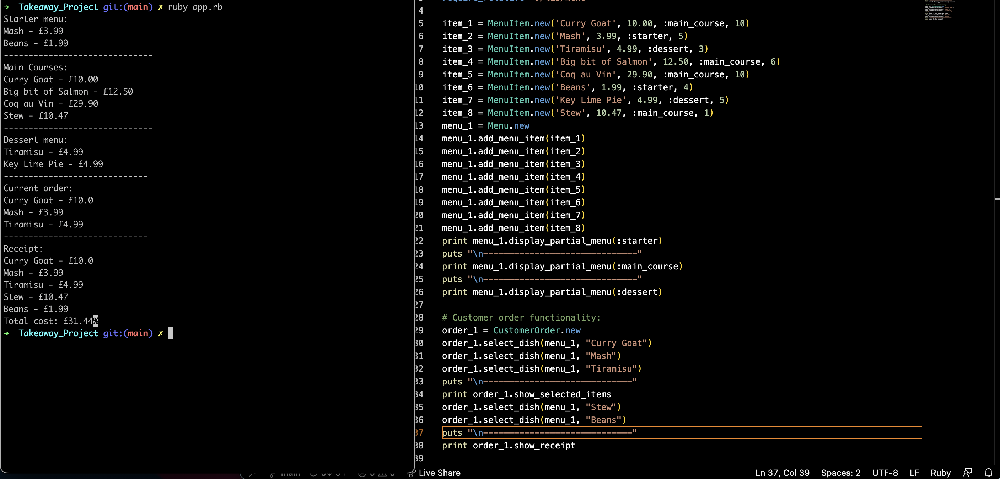
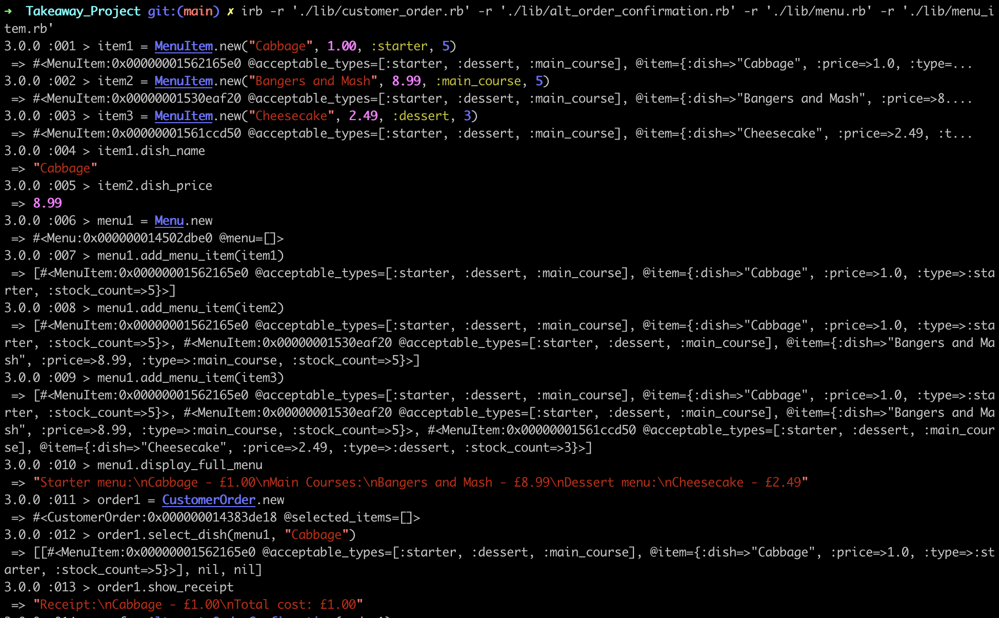

# Deliveruby

## The Task
> As a customer
> So that I can check if I want to order something
> I would like to see a list of dishes with prices.

> As a customer
> So that I can order the meal I want
> I would like to be able to select some number of several available dishes.

> As a customer
> So that I can verify that my order is correct
> I would like to see an itemised receipt with a grand total.

> As a customer
> So that I am reassured that my order will be delivered on time
> I would like to receive a text such as "Thank you! Your order was placed and will be delivered before 18:52" after I have ordered.

## Structure and Approach
I seperated my program into 4 different class'.
``MenuItem`` creates new ``MenuItem`` objects which are represented as a Hash. each ``MenuItem`` attribute can be accessed using their own respective getter method.

Example: For selected MenuItem's price => ``.dish_price => returns a float value``

The ``Menu`` class takes multiple ``MenuItems`` to form a complete ``Menu`` of dishes.
``Menu`` objects deal with the formatting and displaying of the ``MenuItems``. 
It allows multiple menus to be created with differing dishes and also allows the user
to view different aspects of the menu individually.

Example: To only display a Menus dessert options => ``.display_partial_menu(:dessert)``

The ``CustomerOrder`` class allows the selection of items from a taken ``Menu`` object. 
Users are able to then view their current selection and view an itemized receipt
once they are happy with their selection.

Example: To add items to an order => ``.select_dish(menu1, "FishNChip")``
Example: To view current selections => ``.show_selected_items``

The final class ``OrderConfirmation``. utilizes the ruby gem ``Twilio`` and is used solely to produce a confirmation sms message to send to a customer once an order is completed.

I have included two different implementations of this class, as this class requires personal sign up information which are specific to each user. Both versions will be explained in further detail in the installation segment below.

## Installation 
Run the below from the command line:

```
git clone https://github.com/MattHammond94/Deliveruby.git
cd Deliveruby
bundle install
```

If you would like to make use of the twilio gem (To be able to send confirmation texts to a chosen mobile number) you will need to follow the instructions below: 

First go to twilio.com and create an account. 
Once your account is verified you will be provided with a autho token an SID and a twilio number. 
You can also add your chosen number to be used a recipitent. 

Using a environment variables(Recomended):
* Check your current shell by running ```echo $SHELL``` 
* If using ZSH or BASH open home in your code editor and open the ```.zshrc``` or ```.bashrc```
* Add ```export TWILIO_AUTH_TOKEN=INSERT YOUR TOKEN AS A STRING HERE```
* Do the same as the above but for your SID 
* You can also do the same for your mobile numbers for extra security here. 

Once completed you can use the ```alt_order_confirmation.rb``` class by following the running the program guide below.

> Hard coding details into a class: 
> If you are struggling to do use the twilio gem using the ENV variables follow the below:
* Create a class ```twilio_details.rb``` in your lib file
* Add ```/lib/twilio_details.rb``` to your gitignore file.
* Your twilio_details class will need to look as below:

``` ruby
class TwilioDetails
  attr_accessor :account_sid, :auth_token, :twilio_phone_number, :my_number
  def initialize
    @account_sid = '<Your Twilio SID>'
    @auth_token = '<Your Twilio auth token>'
    @twilio_phone_number = '<Your Twilio number>'
    @my_number = '<Your phone number>'
  end
end
```

## Running the program

To create an instances of each class:

```ruby
item1 = MenuItem.new('Curry Goat', 10.00, :main_course, 10) => #Ensure instance is initialised with a string for the title, a float for the price, one of :starter, :main_course or :dessert as a symbol for the type and a int for stock count.

menu = Menu.new

order1 = CustomerOrder.new

confirmation = AlternateOrderConfirmation.new(order1)

#or if you aren't using the ENV variables for twilio
details = TwilioDetails.new

confirmation = OrderConfirmation.new(details, order1)
```

How the class' interact: 

```ruby
item1 = MenuItem.new("Cabbage", 1.00, :starter, 5)
item2 = MenuItem.new("Bangers and Mash", 8.99, :main_course, 5)
item3 = MenuItem.new("Cheesecake", 2.49, :dessert, 3)
menu1 = Menu.new
menu1.add_menu_item(item1)
order1 = CustomerOrder.new
order1.select_dish(menu1, "Cabbage")
order1.show_receipt
# --- The below is dependent on how you utilised your OrderConfirmation class.
confirmation = AlternateOrderConfirmation.new(order1) 
confirmation.send_message
# ---
details = TwilioDetails.new
confirmation = OrderConfirmation.new(details, order1)
confirmation.send_message
```

You can open the codebase in your code editor and make changes to the app.rb file as you see fit. You can then run `ruby app.rb` from the command line to view the results as below:



Alternatively the program can be run using IRB by doing the following: 
```
irb -r './lib/customer_order.rb' -r './lib/alt_order_confirmation.rb' -r './lib/menu.rb' -r './lib/menu_item.rb'
```


## Notes 
There are still further improvements and adjustments I would like to make to expand on this project.

An obvious expansion would be to implement a database connection class and make all the existing class'(with some adjustments) into repo/model class'. This would allow multiple menus to be created and stored in a database to be called on later. You could also create user accounts used to store mobile numbers(Securely - probably with Bcrypt) to allow the sending of sms messages to a specifc user after an order is placed. The user could also view a history of their previous orders etc, etc.

I implemented a stock_count for Menu items which was intended to be used to prevent users from adding dish's which are out of stock. This logic needs to be test driven and added.

Further fail/error cases need to be added to cover all edgecases. The more the program expanded and grew the more edgecases became evident. I'd like to add some fail cases to ensure wherever an item is passed its input is checked(This mainly applies to the select_dish method in the CustomerOrder class and the initializer in the OrderConfirmation.)

Whilst I have 95% test coverage I'd still like to complete the testing by adding tests for the OrderConfirmation class. I was unsure at the time how to mock the send_message method in this class.(I know the functionality works as the current tests cover both the time and body/message included in the SMS. I also know the SMS messages come through as expected as they are sent to my device.)

My tests also need to be amended slightly as my integration tests currently utilise mocks/doubles whereas my unit tests do not. This needs to be rectified.
